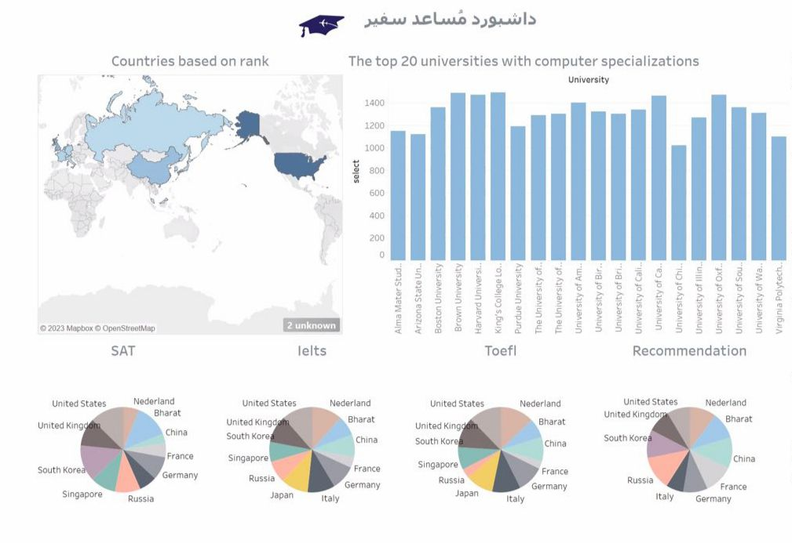

# Musa'ed Safir 

    

 

### Team Member  and Responsibilities 

 Milak Alqathami:
 - Data Collection (Web Scraping)
 - Data Modeling ML 
 - Presentation Slides
 - Logo
   

 Lina Alqahtani:
 - Preprocessing 
 - Data Visualization
 - Data Modeling ML
 - Flowchart
 

Razan Alqahtani:
 - Deploy the Model
 - Artificial Ignorance
 - Web Interface

  
Alaa AlSalman:
  - Web Interface
  - Dashboard

   ## Introduction:
   The Musa'ed Safir project aims to provide assistance to individuals seeking information about universities and studying abroad through the King Salman Scholarship Program. The project offers a user-friendly tool that simplifies the university search process by allowing users to input their desired field of study, academic information, and test scores. The tool then generates a list of universities that are likely to accept them based on their qualifications. By leveraging machine learning techniques and data from the King Salman Scholarship Program, the project builds a predictive model that analyzes user information and provides accurate recommendations based on their desired field of study, academic achievements, and test scores.

  ## Dataset Overview: 

   The project utilizes a dataset obtained through web scraping using the Selenium library and the OpenAI API. The dataset contains relevant information about universities worldwide, including their rankings, programs, admission requirements, and acceptance rates. This data serves as the foundation for the predictive model's analysis and recommendation process.

  ## Proposed Algorithms: 

   The project employs 3 main algorithms for the recommendation system:
   1. Random Forest Classifier .
   2. KNeighbors Classifier .
   3. DecisionTreeClassifier
      

   ## Final Results and Conclusions: 

   We developed a web application that assists users in entering their desired field of study and provides them with a list of universities that are likely to accept them. We generated recommendations for approximately 10 universities.
   Record and Ask was created by Artificial Ignorance using Flask, OpenAI's Whisper, OpenAI's ChatGPT, and ElevenLabs.
  
  The accuracy of our Random Forest Model was measured to be 0.81. 
  
   In conclusion, our web application successfully provides personalized university recommendations based on user input. The integration of various AI technologies and our Random Forest model contributes to the accuracy and effectiveness of the recommendation system.

## Dashboard

    

 

   
